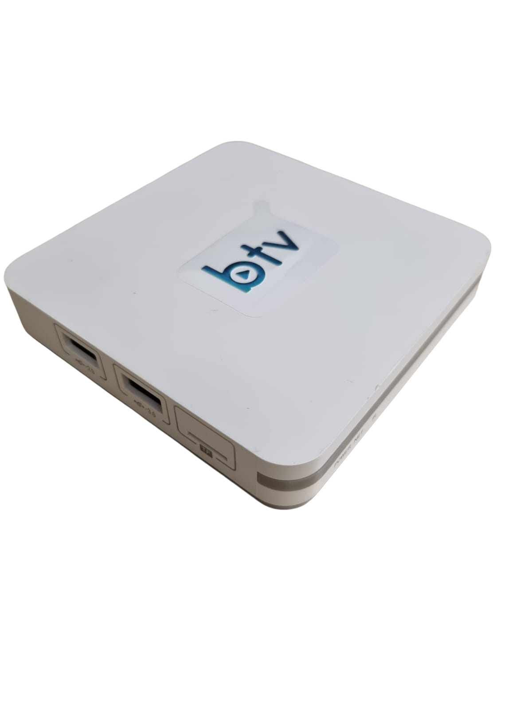
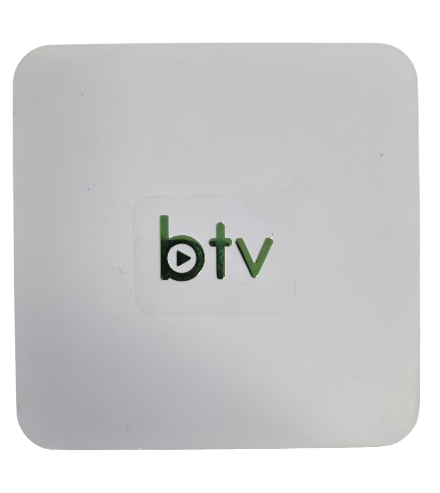
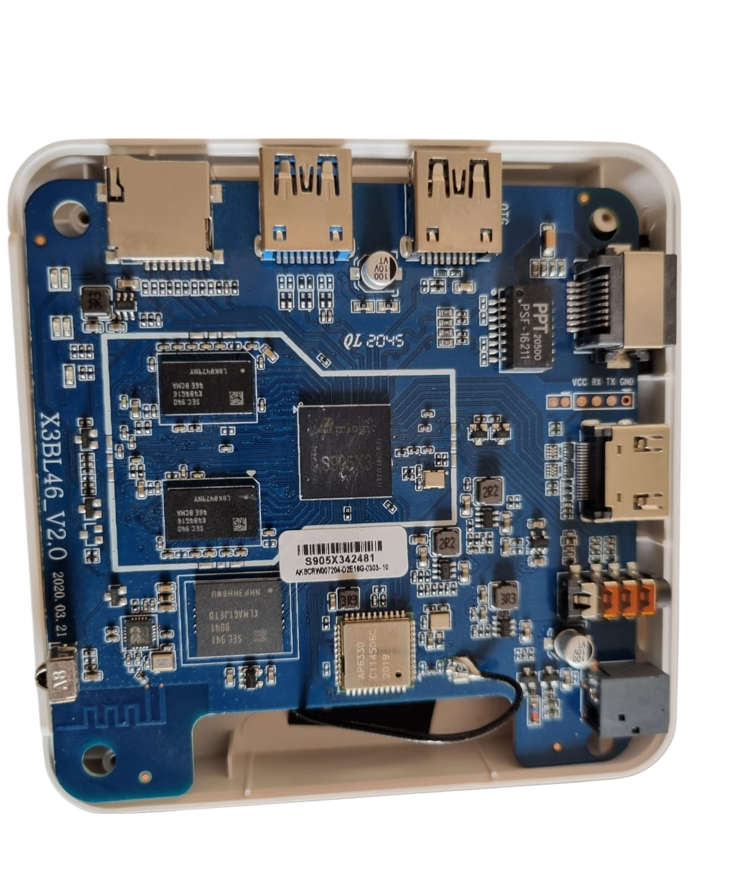

#  Descaracterização do modelo b11

## 🔎 Sumário

- [Informações Gerais](#💻-informações-gerais)
  - [Valores de Hardware](#valores-de-hardware)
  - [Imagem do modelo](#imagem-do-modelo)
  - [Sistema operacional original](#sistema-operacional-original)
  - [Suporte de rede](#suporte-de-rede)
- [Desempenho](#📈-desempenho)
- [Ferramentas utilizadas para descaracterização](#🛠-ferramentas-utilizadas-para-descaracterização)
  - [Hardware](#hardware)
  - [Software](#software)
- [Descaracterização: Processo detalhado](#📖-descaracterização-processo-detalhado)
  - [Cuidados necessários](#cuidados-necessários)
  - [Inicializando o Armbian na TV Box pelo cartão SD](#inicializando-o-armbian-na-tv-box-pelo-cartão-sd)
  - [Configuração inicial do Armbian](#configuração-inicial-do-armbian)
  - [Instalação do sistema no armazenamento interno](#instalação-do-sistema-no-armazenmento-interno)
- [Erros comuns](#❌-erros-comuns)

## 💻 Informações gerais

### Valores de hardware

(Os valores na tabela abaixo foram obtidos por meio da plataforma AIDA64)

| Medida                   | Valor detectado | Valor nominal |
| ------------------------ | --------------  | ------------- |
| CPU S905X3               |     1908 Mhz    |     1,9 Ghz   |
| Armazenamento interno    |     11,13 GB    |      16 GB    |
| Memória RAM              |      2000 MB    |      2 GB     |

### Imagem do modelo

|Box          | Circuito   |
|-------------|------------|
|  | 

### Sistema operacional original

Android (pré-instalado).

### Suporte de rede (módulo Realtek rtl8822cs - driver rtl8822cs)

⚠️ _Até o momento não foi obtido nenhum suporte para Wi-Fi, mas [discussões no fórum Armbian](https://forum.armbian.com/topic/16696-armbian-for-tanix-tx3-amlogic-s905x3-with-sp6330-wifibluetooth-module/) sugerem que ele pode ser configurado seguindo uma série de passos._

O módulo de rede identificado para esse modelo é o: **Ampak AP6330**, para o qual o driver correspondente ainda não foi corretamente identificado, mas está relacionado a uma configuração dos arquivos no diretório **lib/aarch-64/firmware/**.

- Wi-fi: Supostamente é suportado pelo Armbian.
- Bluetooth: Ainda não testado.<!-- Necessário confirmar -->
- Ethernet: Suporte completo.

## 📈 Desempenho

| Atividades                   | Avaliação |
| ---------------------------- | --------- |
| Navegar em páginas           | 🟢 BOM   |
| Assistir vídeos              | 🟢 BOM   |
| Jogar                        | 🟠 MÉDIO |
| Utilizar como servidor       | 🟢 BOM   |

## 🛠 Ferramentas utilizadas para descaracterização

### Hardware

- Computador ou notebook: utilizado para manipular os arquivos necessários e criar um cartão SD bootável.
- Cartão SD: utilizado para gravar o sistema operacional Armbian na B11.
- Monitor, teclado, mouse e cabo HDMI: utilizado para interagir com a B11.

### Software

- Balena Etcher, Rufus ou dd: utilizado para gravar o sistema no cartão SD.

## 📖 Descaracterização: Processo detalhado

### Cuidados necessários

- Sempre ejete o cartão SD pelo sistema operacional antes de removê-lo do computador.
- Baixe a imagem correta do Armbian. As imagens mais recentes do projeto [Armbian para Amlogic](https://www.armbian.com/amlogic-s9xx-tv-box/) mantidas pela comunidade tem funcionado com sucesso quando configuradas corretamente.

### Inicializando o Armbian na TV Box pelo cartão SD

_Disclaimer1: Caso algum termo não seja compreendido, verifique-o na seção [glossário](../../material-de-apoio/glossario.md)_

_Disclaimer2: Muitos modelos com [SoC](../../material-de-apoio/glossario.md#SoC) Amlogic S905X3 tiveram problema de compatibilidade com as imagens oficiais geradas pelo projeto Armbian, isso se deve em especial por causa do u-boot, responsável por inicializar o sistema. Para isso foram encontradas duas soluções: modificiar manualmente os scripts para inicializar o sistema através de bootloader proprietário, ou utilizar imagens de um projeto extra-oficial, que possuem u-boots selecionados para cada arquivo [dtb](../../material-de-apoio/glossario.md#dtb). Aqui utilizaremos a segunda solução._

1. Baixe os software e arquivos necessários no computador/notebook.

- Software de criação de mídia bootável (baixe apenas um de sua escolha)
  - Recomendado: [Balena Etcher (Tutorial de instalação e uso)](https://etcher.balena.io/)
  - Alternativa: [Rufus (Tutorial de instalação e uso)](https://rufus.ie/pt_BR/)
  - Alternativa: [dd (Tutorial de instalação e uso)](https://medium.com/@emusyoka759/creating-a-bootable-usb-in-ubuntu-with-dd-9fb3debc0814)
- Imagem do Armbian (variante do projeto ophub)
  - [Armbian 25.11.0 Gnome Desktop](https://drive.google.com/file/d/1-zZcubFN1tUw9vXrl_DSIvE7KVQduUzG/view?usp=drive_link)
  - [Mirror 1 - Onedrive](https://unioestebr-my.sharepoint.com/:u:/g/personal/gabriel_nieto_unioeste_br/EVR_IIvpbPxJgCRhdvEGFdUBdTE-YwXT3osKqDs4jyaFJA?e=LxhCkJ)
  - 💡  Essa imagem foi a que mostrou melhores resultados, mas você também pode experimentar com as builds mais recentes do Armbian no [site oficial](https://www.armbian.com/amlogic-s9xx-tv-box/) 
- Scripts modificados de boot (Necessário para o boot nessa box! Créditos ao devmfc)
  - [Scripts - source.zip](https://github.com/devmfc/amlogic-bootscripts-Armbian/releases/tag/v3)
  - [Mirror 1 - Internet Archive](https://archive.org/details/amlogic-bootscripts-armbian-32)
  - [Mirror 2 - Google Drive](https://drive.google.com/file/d/1uJ1VTxr0qR2eQP7uGPI0Y7YekLL-2sA0/view?usp=drive_link)
2. No computador/notebook, insira o cartão SD e Utilize um dos programas anteriores para gravar a imagem no cartão SD.
3. Entre no diretório raiz do cartão SD após a gravação da imagem, onde diversas pastas e arquivos com extensão .bin podem ser encontrados.
4. Copie os arquivos aml_autoscript, ArmbianEnv.txt, emmc_autoscript e s905_autoscript baixados anteriormente na sessão de scripts modificados para o diretório raiz 
5. Abra o arquivo ArmbianEnv.txt e extlinux.conf (presente em /extlinux/extlinux.conf) com um editor de texto qualquer e substitua o que estiver escrito após "fdtfile=amlogic/" por "meson-sm1-sei610.dtb". Salve o arquivo e feche.
  - 💡Alternativamente, você também pode testar a compatibilidade do seguinte arquivo dtb:
    - [meson-sm1-sei610-ethfix.dtb](/.assets/meson-sm1-sei610-ethfix(2).dtb)
    - [Mirror 1 - Google drive](https://drive.google.com/file/d/1Fkg5QHTR4dwrnfF62zqoHsWRvZ285YU5/view?usp=drive_link)
    - [Mirror 2 - Internet Archive](https://archive.org/details/meson-sm1-sei610-ethfix2)
6. Faça uma cópia do arquivo u-boot-s905x3.bin, também presente no diretório raiz do cartão SD, e renomeie essa cópia para u-boot.ext.
7. Remova o cartão SD do computador/notebook.

- Ejete o cartão SD pelo sistema operacional antes de removê-lo, para evitar possível corrupção.

8. Insira o cartão SD por meio de um adaptador USB na B11 desligada e conectada à um monitor/televisão por cabo HDMI.
9. Pressione o botão update com um clip de papel desdobrado ou um palito de dente (o botão pode ser encontrado dentro de um "furo" na parte debaixo da TV Box) e conecte a fonte de alimentação enquanto o botão ainda estiver pressionado. Mantenha o botão de update pressionado e solte assim que algum sinal de vídeo for observado no monitor/televisão.
⚠️Lembre-se⚠️: o sistema está funcionando por meio do cartão SD, ou seja, caso removido, o firmware original da tv box ascenderá novamente, mas nunca retire o cartão SD com o aparelho ligado. Um tópico mais a frente ensinará a gravar o sistema no armazenamento interno, apagando todo o firmware original da TV Box.

### Configuração inicial do Armbian

Após inicializar o sistema pela primeira vez, é pedido ao usuário que forneça algumas informações de configuração, como nome de usuário, senha, configuração de zonas de tempo e afins. O processo é bem intuitivo.

### Instalação do sistema no armazenmento interno

⚠️Cuidado⚠️: Esta ação vai apagar todos os dados presentes no armazenamento da sua TV Box, convém fazer um backup.

⚠️Lembre-se⚠️: para cumprir esta etapa, é muito importante que uma cópia do u-boot correto tenha sido feita, conforme a etapa 5 do [**Inicializando o Armbian na TV Box pelo cartão SD**](##inicializando-o-armbian-na-tv-box-pelo-cartão-sd).

Após a configuração, execute o comando

```bash
sudo su
cd
./install-aml.sh
```

E confirme o que for pedido

## ❌ Erros comuns

1. Caso não seja identificado sinal de vídeo após cumprida a etapa 8 do tópico "Inicializando o Armbian na TV Box pelo cartão SD", verifique se o cabo HDMI funciona e está conectado corretamente. Em caso afirmativo, tudo indica que ou o sistema foi identificado, mas não é compatível, ou o arquivo .dtb utilizado não é o certo.
2. O Comando ``` sudo apt update && sudo apt upgrade``` tem chances de tornar a imagem instalada na memória interna impossível de ser bootada, portanto, tome cuidado com este comando. <!--(Até agora(27/10/25), não foi encontrado nenhuma solução nem causa para este problema, em caso de novas informações por favor adicionar!) -->
3. Por alguma razão desconhecida, o armbian apenas reconhece 1GB de RAM no sistema, e por mais que reconheça o chip de Wi-Fi, ele não consegue ler as redes próximas. Estes e outros erros provavelmente estão sendo causados por algumas incompatibilidades com os arquivos .dtb.
